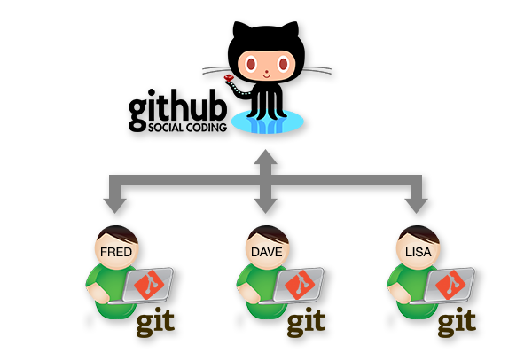
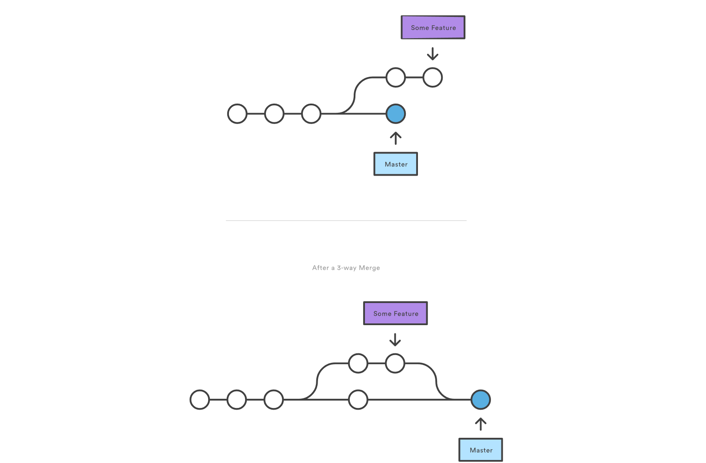
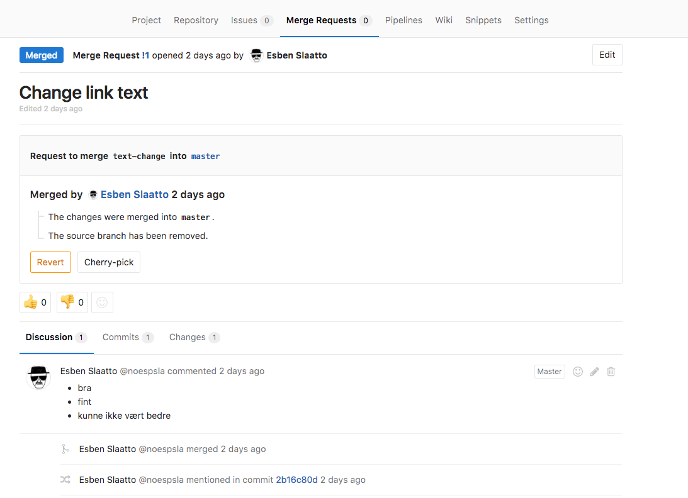
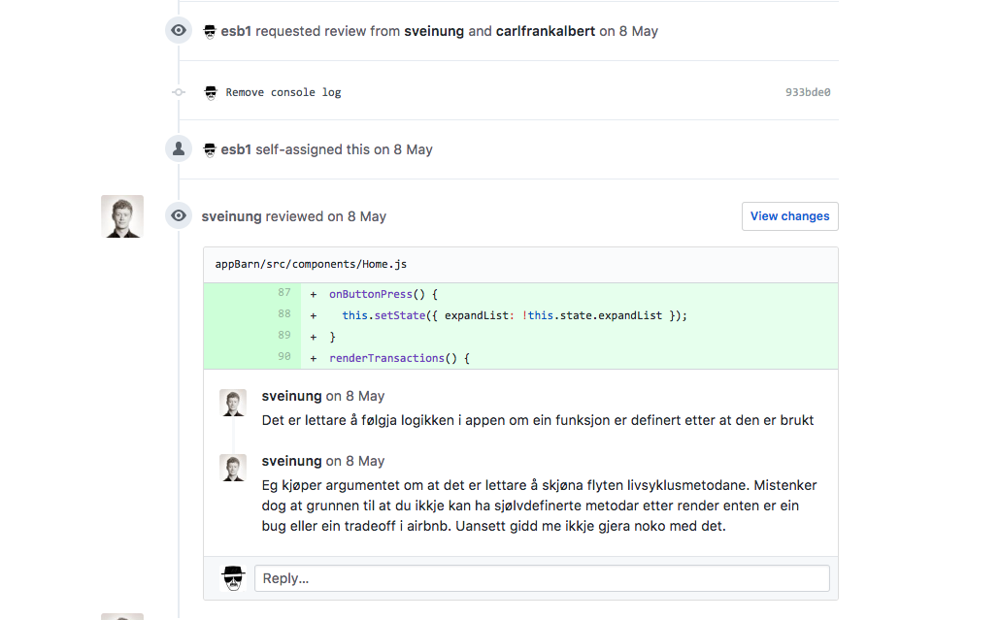

## GIT


---

### Hva er git
-   Samhandlingsverktøy |
-   Versjonskontroll |

+++

### Samhandling

```
git pull
git push
```
+++

### Versjonskontroll


```
git add  # Legge til endringer til Staging Area
git commit  # Legge til endringer i commit historikken
```

+++

### Din gode venn hvis ting går helt galt
```
git reset --hard HEAD
```

---

### Branches


> Kopier prosjektets _tilstand_ og jobb uforstyrret videre

+++

### Feature branches
-   Lag en kopi av master |
-   Implementer en feature |
-   Test at det fungerer slik det skal |
-   Merge din branch inn i master |

+++



+++
Hvis det er flere på prosjektet:<br>
_Merge endringer fra master til din branch før du tester at koden din virker_<br>
_Pull request før man merger til master_


---?code=src/common-commands.sh
### De _vanligste_ kommandoene
@[1-2](Oppdaterer ditt lokale repo til å matche remote)
@[3-4](Dytter dine endringer til remote)
@[6](Liste over brancher lokalt)
@[7](Lag ny branch)
@[8](Bytt til valgte branch. _Tar med endringer som ikke er commited_)
@[10-11](Legg endringer til i _staging area_)
@[12-13](Legg endringer til i historikken)
@[15](Working directory vs historikk. _Før `git add`._)
@[16](Staging area vs historikk. _Etter `git add`._)
@[17](Working direcory status på filnivå. _Hvilke filer som har endringer, nye filer osv._)
@[19](_Gjem_ alle endringer)
@[20](Hent de siste endringene som ble _stashet_)
@[22](Kopier repo lokalt, og la remote være original-repoet)
@[23](Kopier repo lokalt, og la remote være en kopi av originalen)
@[25-27](Gjør lokal historikk lik som `<commit>`, men bevar endringer<br>_Start på nytt_)
@[28](Gjør lokal historikk lik som `<commit>` og slett endringer)
@[29-30](Slett endringer gjort etter `<commit>`)
@[32-33](Se historikken)
@[34](Se info om `<commit>`)
@[36-37](slå sammen to brancher)

+++

### Typical workflow

```sh
~master$ git pull
~master$ git checkout -b new-feature
~new_feature$ touch SomeComponent.jsx
# create fantastic code
~new_feature$ git add SomeComponent.js
~new_feature$ git commit -m "Add new fantastic component"
~new_feature$ git push
```
@[1](Henter endringer andre har gjort på master)
@[2](Bytt til branch med gitt navn. `-b` lager ny branch dersom den ikke finnes)
@[3-4](Opprett ny fil)
@[5](Legg til fil i staging area)
@[6](Commit endringene til git historikken med melding)
@[7](Dytt endringene til GitLab/GitHub)

+++

### Hvordan slippe å skrive inn passord hver gang?

```sh
some_user$ ssh-add # hvor som helst i repoet ditt

Enter passphrase for /Users/some_user/.ssh/id_rsa: *******
```

---
### Pull requests
### Merge requests
La team-medlemmer reviewe din kode før du _merger_ den inn i prosjektet

+++


+++


---

## Demo/praksis
